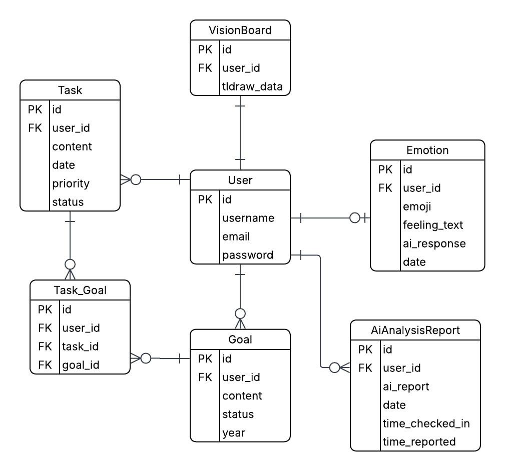

# BEAM

## DESCRIPTION

Beam is my solo capstone project for the Software Engineering Bootcamp, presented by General Assembly, with support from the Saudi Digital Academy.

Beam is a full-stack productivity app that allows users to:
- Track tasks and display them in an integrated calendar
- Link tasks to goals
- Track mood and receive AI-generated insights/supportive messages
- Use a whiteboard for mind mapping or vision boards, including image support

The core idea of this app is to enhance productivity in a healthy way, supporting users to manage tasks effectively while taking care of their mental well-being.

## CORE FEATURES:
### Authentication
- Users can create an account and securely log in using JWT-based authentication.
- Authenticated users gain access to personalized dashboards, tasks, goals, mood tracking, and vision boards.
### Dashboard
Displays important information to the user such as:
- Frequency of selected moods (emojis) throughout the month (pie chart)
- Highest priority task of the day
- Progress of today’s assigned tasks
- All goals and the number of tasks completed toward them (bar chart)
- Calendar displaying each day’s selected mood/emoji
- Supportive message if a goal is achieved
- AI analysis of trends based on tasks, progress, journal, and mood entries to personalize AI responses

### Visionboard
- A whiteboard that allows users to paste images and design inspiration boards
- Users can create multiple pages

### Goals
- Users can set goals and alter their status (active/completed)
- Goals can be filtered based on status

### Tasks
- Users can navigate to any day in the calendar to add/view tasks
- Tasks can be linked to long-term goals
- Tasks are arranged by priority and can be filtered by status

### Mood & Journal Check-In
- Users can check in once a day by selecting an emoji representing their mood
- Users can write a journal describing their feelings
- Responses are processed by a mental health assistant LLM to provide personalized supportive messages


## TECH STACK
### Backend:
- Language & Framework: Python, Django
- API Library: Django REST Framework, djangorestframework-simplejwt (JWT authentication)
- Middleware: CORS Headers
- Database: PostgreSQL
- AI / LLM: Ollama (local) with the ALIENTELLIGENCE/mentalwellness model
- Environment / Config: python-decouple, python-dotenv
### Frontend:
- Framework & Libraries: React, React Router
- Styling: Tailwind CSS, Vanilla CSS
- Tools & Libraries: Schedule-X, Tldraw, Shadcn, JWT-Decode, Axios
### Dev tools:
- Git & GitHub
- Docker
- Postman

## FRONT-END REPOSITORY
[Front End](https://github.com/shouqv/wellbeing-productivity-frontend)

## ERD DIAGRAM


## ROUTING TABLE

| Method | URL Pattern | Handler | Action |
|:--------|:-------------|:---------|:--------|
| POST | /api/signup/ | SignupUserView | Create a new user account |
| POST | /api/login/ | TokenObtainPairView | Allow users to login and obtain JWT token |
| POST | /api/token/refresh/ | TokenRefreshView | Refresh JWT token |
| GET | /api/goals/ | GoalsIndex | List all goals for authenticated user |
| POST | /api/goals/ | GoalsIndex | Create a new goal for authenticated user |
| GET | /api/goals/:id/ | GoalDetail | Get details of a specific goal for an authenticated user |
| PUT | /api/goals/:id/ | GoalDetail | Update goal details for an authenticated user |
| DELETE | /api/goals/:id/ | GoalDetail | Delete a specific goal for an authenticated user |
| GET | /api/tasks?date=YYYY-MM-DD/ | TasksIndex | Get tasks for a specific day if date is specified, otherwise get all tasks for an authenticated user |
| POST | /api/tasks/ | TasksIndex | Create a new task for an authenticated user |
| GET | /api/tasks/:id/ | TaskDetail | Gets the authenticated user's tasks information, including the linked and unlinked goals |
| PUT | /api/tasks/:id/ | TaskDetail | Update task details for the authenticated user |
| DELETE | /api/tasks/:id/ | TaskDetail |Delete a task for the authenticated user |
| GET | /api/emotions/ | EmotionIndex | Gets the authenticated user's entered emotions |
| POST | /api/emotions/ | EmotionIndex | Create a new mood entry for the authenticated user and get AI response |
| PATCH | /api/tasks/:task_id/link-goal/:goal_id/ | LinkGoalToTask | Link a task to a goal for an authenticated user |
| PATCH | /api/tasks/:task_id/unlink-goal/:goal_id/ | UnLinkGoalToTask | Unlink a task from a goal for the authenticated user |
| GET | /api/emotions/check/ | CheckTodayEmotionSubmission | Check if the authenticated user has submitted mood today |
| GET | /api/visionboard/ | VisionBoardDetial | Retrieve the authenticated user's vision board |
| PUT | /api/visionboard/ | VisionBoardDetial | Update the authenticated user's vision board |
| GET | /api/dashboard/ | DashBoardInfo | Retrieve the authenticated user's dashboard data including mood trends, task progress, and AI insights |


## INSTALLATION INSTRUCTION (Docker)
1. Clone both repositories into the same parent folder:

```
parent-folder/
├── wellbeing-productivity-backend/
└── wellbeing-productivity-frontend/
```

- Backend:
```
git clone https://github.com/shouqv/wellbeing-productivity-backend.git
```

- Frontend:
```
git clone https://github.com/shouqv/wellbeing-productivity-frontend.git

```

2. Run Docker Compose from the backend folder:
```
cd wellbeing-productivity-backend
docker-compose up --build
```

Note:
- The AI model (Ollama, ALIENTELLIGENCE/mentalwellness) should be installed and running locally for LLM-based features

## ICEBOX FEATURES

- Allow users to view their journal entries in addition to mood entries.
- Implement reminders so users can be notified of upcoming or pending tasks.
- Provide a dedicated account page where users can view and edit additional profile information.
- Make AI-generated supportive messages personalized like the trend analysis response. Currently, only the trend analysis is tailored to the user.
